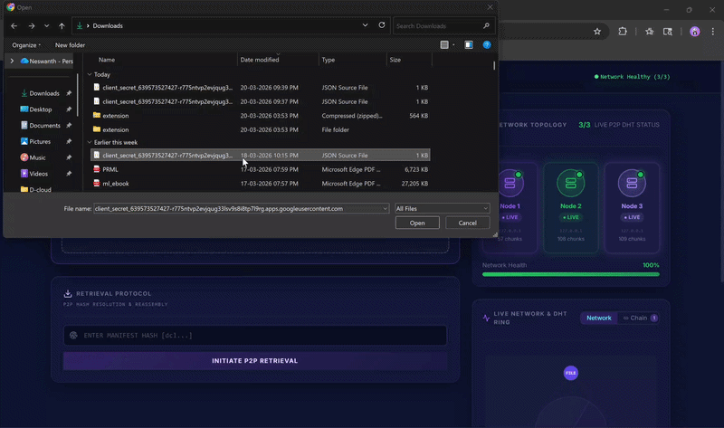
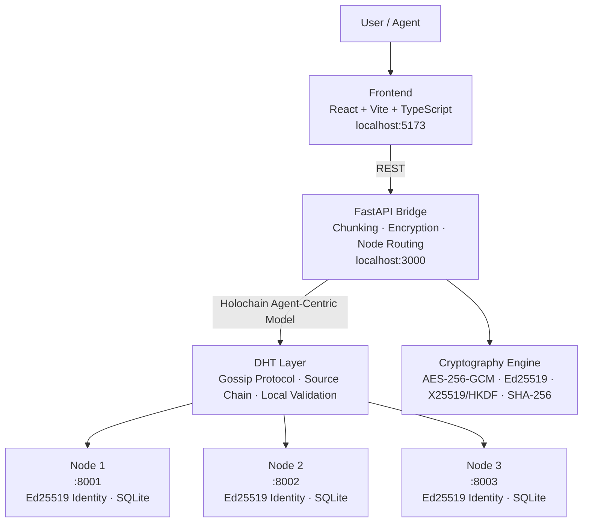

# D-Cloud

> Decentralized, agent-centric cloud storage — no central control plane, no vendor lock-in, no blockchain overhead.


[Product Site →](https://neswanths.github.io/public_face_for_d-cloud/)
[Watch full demo →](https://drive.google.com/file/d/1_mv_s_McooPA5eOnclQVtpPp7hXJhhSR/view?usp=sharing)

---

## What is D-Cloud?

D-Cloud is a decentralized, agent-centric cloud architecture that removes centralized control, reduces vendor lock-in, and improves security and availability without the scalability costs of blockchain-based solutions.

Centralized cloud providers like AWS create single points of failure — one outage cascades across every service depending on them. Blockchain alternatives solve the trust problem but introduce global consensus overhead, making them impractical for real storage workloads. D-Cloud takes a third path: Holochain's agent-centric model, where every node is a sovereign peer with its own cryptographic identity, local validation, and no dependence on any central authority or global ledger.

Every file is split into encrypted, signed chunks distributed across the mesh. Any node can go down — the data survives. No node ever sees the full file. No master key exists.


---

## How it works

When you upload a file:

1. The file is split into **64 KB chunks**, each assigned a SHA-256 content address
2. Each chunk is encrypted with a per-file **AES-256-GCM** key (DEK)
3. Every chunk is **Ed25519 signed** — unforgeable proof of custody
4. The DEK is wrapped uniquely for each peer's **X25519 public key** and stored in the manifest — no central key server
5. The manifest (a Merkle root of all chunk hashes) is broadcast to all live nodes via the gossip layer

On retrieval, the bridge unwraps the DEK using its private key, fetches chunks from any available node, verifies every signature and hash, and reassembles the file. A dead or compromised node is automatically skipped.

---

## Architecture



Each node is an independently addressable agent with its own cryptographic identity and local source chain. The gossip protocol keeps nodes in sync without requiring global consensus — no node needs to see the full picture to validate its own data.

---

## Stack

| Layer | Technology |
|---|---|
| Frontend | React 19, Vite 7, TypeScript, Tailwind CSS |
| Bridge API | Python, FastAPI, Uvicorn |
| Cryptography | AES-256-GCM, Ed25519, X25519/ECDH, HKDF, SHA-256 |
| Node Layer | Python, SQLite, Holochain agent-centric model |
| DNA & Zomes | Rust, HDK 0.3.6, HDI 0.4.6, WASM |
| Launcher | PowerShell with subnet auto-discovery |

---

## Security Model

- **AES-256-GCM** — authenticated encryption for every chunk; tampering is detected before decryption completes
- **Ed25519 signatures** — each chunk carries an unforgeable proof of which node stored it
- **X25519 + HKDF key wrapping** — the DEK is encrypted per-recipient; no node ever sees another peer's plaintext key
- **Merkle root verification** — the full file hash is recomputed on retrieval and compared against the manifest; any corruption is caught before the file is served
- **Zero trust retrieval** — every chunk is independently verified at the bridge before reassembly
- **No master key** — users own their encryption keys; complete data sovereignty

---

## Running locally

**Prerequisites:** Python 3.11+, Node.js 18+, PowerShell 7+

```powershell
# Clone the repo
git clone https://github.com/neswanths/d-cloud.git
cd d-cloud

# Install bridge dependencies
cd api-bridge
pip install -r requirements.txt
cd ..

# Install frontend dependencies
cd frontend
npm install
cd ..

# Launch everything
./start.ps1
```

The launcher first scans for LAN nodes. If none are reachable, it automatically switches to single-machine mode and spins up 3 local nodes. Once running:

- Frontend → http://localhost:5173
- Bridge API → http://localhost:3000/api/health

---

## Project Structure

```text
d-cloud/
├── api-bridge/          # FastAPI bridge — chunking, crypto, node routing
│   ├── main.py          # REST endpoints and orchestration
│   ├── crypto.py        # AES-GCM, Ed25519, X25519 implementation
│   ├── node_pool.py     # Fault-tolerant node management
│   └── keys/            # Generated Ed25519/X25519 keypairs
├── dnas/                # Holochain DNA — integrity & coordinator zomes (Rust/WASM)
├── frontend/            # React/Vite UI
├── js-client/           # JS client library for Holochain Conductor API
├── node_server.py       # Standalone DHT node (SQLite-backed)
├── scripts/             # Setup and test utilities
└── start.ps1            # Smart launcher with LAN/local fallback
```

---

## Current Status

Working local prototype with a fully implemented cryptographic pipeline. The system handles real encryption, real signing, real fault-tolerant retrieval, and real multi-node distribution on a single machine or across a LAN.

**What's working:**
- Full encrypt → sign → chunk → distribute → verify → reassemble pipeline
- Automatic dead-node failover during retrieval
- Multi-recipient DEK wrapping (each peer gets an independently wrapped key)
- LAN auto-discovery with single-machine fallback
- Persistent chunk storage across node restarts (SQLite)
- Holochain DNA with integrity and coordinator zomes (Rust/WASM)

**What's next:**
- True DHT gossip protocol replacing broadcast replication
- Node registration and dynamic peer discovery
- Public testnet deployment

---

## License

MIT
